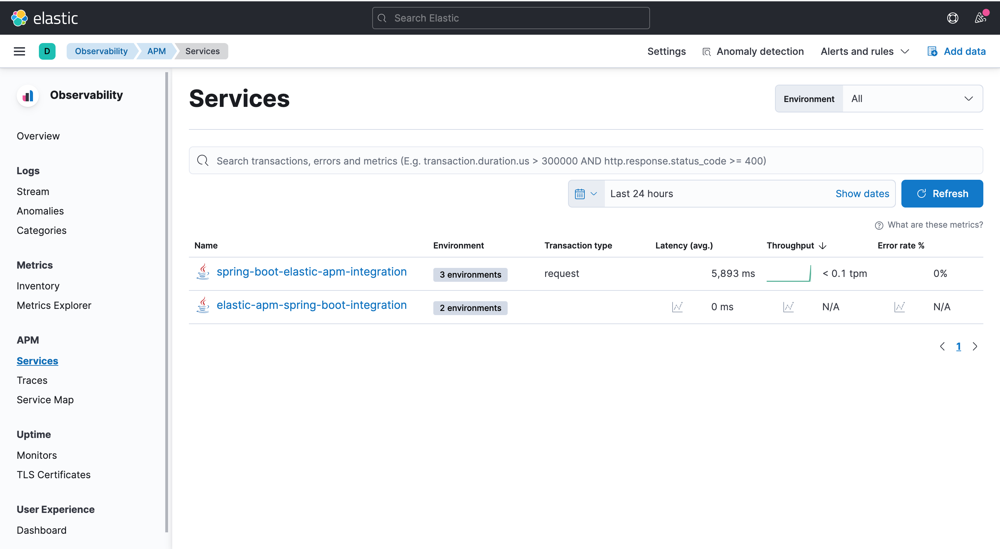
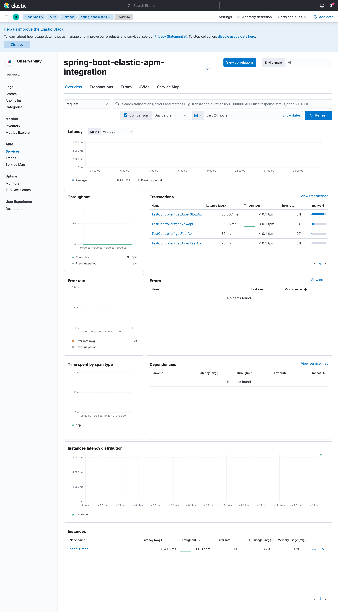
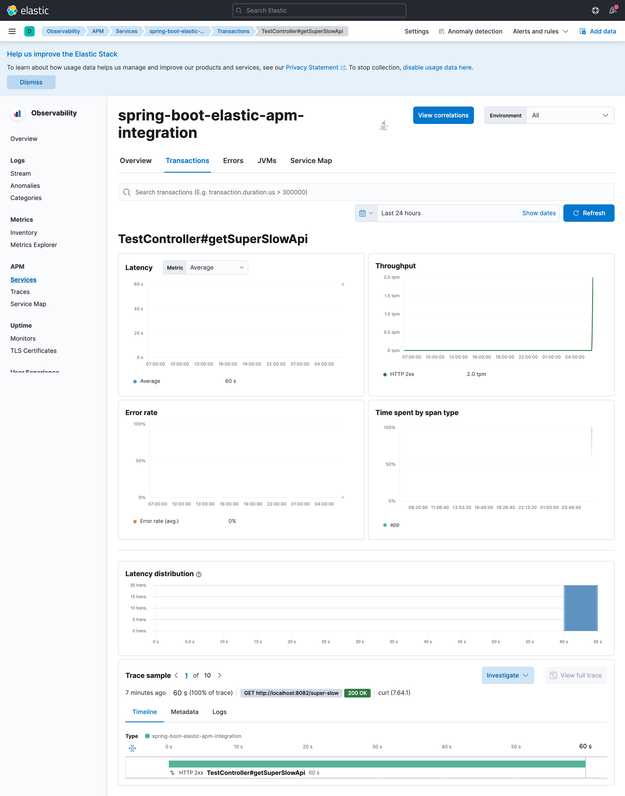

# spring-boot-elastic-apm-integration
##### Docker configuration
There are three options for this configuration

option 1. elasticsearch,and apm-server ssl is not enabled
   spring-boot-elastic-apm-integration\docker-compose.yml

option 2. APM Server outputs that support SSL, like Elasticsearch
   spring-boot-elastic-apm-integration\docker-compose-single-node-2.yml

option 3. APM Server outputs that support SSL, like Elasticsearch and inputs also support SSL
   spring-boot-elastic-apm-integration\docker-compose-single-node-3.yml

1. As the elasticsearch generates the ca and certificates and in the cert volume, elasticsearch and kibana user can have root privilege to read the cert files
but apm-server user cannot. So the following steps needs to be done after starting the elasticsearch docker container first time only to copy the certificates from the docker to the local hosts
and unzip them to override them in the project working dir.(start docker-compose and copy files in the first time only and restart docker-compose and right now I could not find a good way to resolve it.)

It is only applied for option2 and option3 and all certs files need to be updated locally

spring-boot-elastic-apm-integration>docker cp b11763d2f4da:/usr/share/elasticsearch/config/certs/ca.zip .
spring-boot-elastic-apm-integration>docker cp b11763d2f4da:/usr/share/elasticsearch/config/certs/certs.zip .  // b11763d2f4da is es container id

2. add an apm integration
   Open Kibana and select Add integrations > Elastic APM.
   Click APM integration.
   Click Add Elastic APM.
   Click Save and continue.
   Click Add Elastic Agent later. You do not need to run an Elastic Agent to complete the setup.

   Server configuration,change host and url to
   http-> http://localhost:8200
   https->https://localhost:8200

3. if apm-server https is used(option3),use keytool to import the cert into the keystore
    keytool -import -alias apm-server-cert -file apm-server.crt -keystore C:\Java\jdk-17\lib\security\cacerts

4. change elastic.apm.server-url to support ssl or not in spring boot project properties files

####  Docker configuration (elasticsearch 8.8.2)
There are three options for this configuration

1. elasticsearch,and apm-server ssl is not enabled

   spring-boot-elastic-apm-integration\docker-compose.yml

2. APM Server outputs that support SSL, like Elasticsearch

   spring-boot-elastic-apm-integration\docker-compose-single-node-2.yml

3. APM Server outputs that support SSL, like Elasticsearch and inputs also support SSL

   spring-boot-elastic-apm-integration\docker-compose-single-node-3.yml

4. As the elasticsearch generates the ca and certificates and in the cert volume, elasticsearch and kibana user can have root privilege to read the cert files
   but apm-server user cannot. So the following steps needs to be done after starting the elasticsearch docker container first time only to copy the certificates from the docker to the local hosts
   and unzip them to override them in the project working dir.(start docker-compose and copy files in the first time only and restart docker-compose and right now I could not find a good way to resolve it.)

It is only applied for option2 and option3 and all certs files need to be updated locally

spring-boot-elastic-apm-integration>docker cp b11763d2f4da:/usr/share/elasticsearch/config/certs/ca.zip .

spring-boot-elastic-apm-integration>docker cp b11763d2f4da:/usr/share/elasticsearch/config/certs/certs.zip .  // b11763d2f4da is es container id

5. add an apm integration
   Open Kibana and select Add integrations > Elastic APM.
   Click APM integration.
   Click Add Elastic APM.
   Click Save and continue.
   Click Add Elastic Agent later. You do not need to run an Elastic Agent to complete the setup.

   Server configuration,change host and url to
   http-> http://localhost:8200
   https->https://localhost:8200

6. if apm-server https is used(option3),use keytool to import the cert into the keystore
   keytool -import -alias apm-server-cert -file apm-server.crt -keystore C:\Java\jdk-17\lib\security\cacerts

7. change elastic.apm.server-url to support ssl or not in spring boot project properties files

### Things todo list:

1. Clone this repository: `https://github.com/hendisantika/spring-boot-elastic-apm-integration.git`
2. Navigate to the folder: `cd spring-boot-elastic-apm-integration`
3. Start the Elasticsearch, Kibana, and Elastic APM servers [terminal 1]: `docker compose up`
4. Start the predev environment [terminal 2]: `mvn spring-boot:run -Dspring-boot.run.profiles=predev`
5. Start the dev environment [terminal 3]: `mvn spring-boot:run -Dspring-boot.run.profiles=dev`
6. Start the staging environment [terminal 4]: `mvn spring-boot:run -Dspring-boot.run.profiles=staging`
7. Start the prod environment [terminal 5]: `mvn spring-boot:run -Dspring-boot.run.profiles=prod`
8. Open Kibana Dashboard: http://localhost:5601/app/apm/services?rangeFrom=now-15m&rangeTo=now
9. Generate some traffic on the different environments using the test-apis.sh script. The script will call each endpoint
   defined in the TestController (/super-fast, /fast, /slow, and /super-slow ) ten times in each environment. Notice
   that the prod environment does not expose the /super-slow endpoint. This is meant to simulate a scenario where a new
   feature is being tested and is not yet deployed to production. `chmod +x test-apis.sh && ./test-apis.sh`

### Images Screen shot

Elastic APM Server Dashboard

Super Fast API Details

Fast API Details

Super Slow API Details

Slow API Details

Article Source: https://levelup.gitconnected.com/how-to-integrate-elastic-apm-java-agent-with-spring-boot-7ce8388a206e

